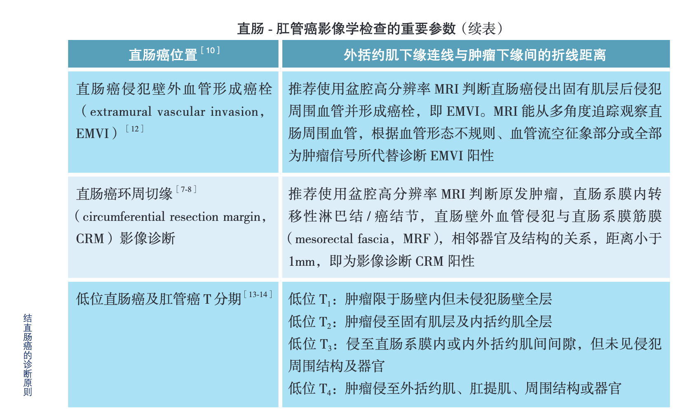

## 癌栓是什么?

转移是恶性肿瘤最常见和最主要的特征. 大多数实体瘤一般在原发瘤周围先形成癌栓, 再远处转移.

什么是癌栓? 癌细胞从原发灶脱落, 侵入脉管, 即与脉管内的异种细胞结合, 形成微小转移灶, 这就是癌栓(VI).

癌栓是肿瘤细胞与其他不同细胞的混合体, 由它再漂浮转移至人体各脏器脉管, 再种植生长, 形成各种转移病灶.

不同于血栓, 也不完全类似于肿瘤的生长, 它是癌细胞和其他细胞(大多是血细胞)交互的混合物, 因此它既有栓塞血管作用, 同时又有癌细胞浸润功能, 是恶性肿瘤转移关键的起始阶段. [[1]](../assets/建立%20_癌栓学%20_的设想及意义%20-%20中华医学杂志.html)

癌栓的特性注定了其危害性很大. 因栓塞血管导致血管血流不畅, 压力陡增, 致出血或脏器衰竭.

癌栓是肿瘤常见并发症之一, 是指癌细胞在生长, 繁殖, 转移过程中, 侵袭或堆集血管和淋巴系统, 或引起血液的凝血异常, 导致血管功能和血液运行障碍、异常凝血、血栓形成, 产生一系列病理生理改变的肿瘤并发症.

此症可影响肿瘤病人的生存期和生存质量, 发生在人体重要组织和器官的癌栓更严重地危及肿瘤病人的生命, 甚至使病人很快死亡. 由于癌栓可发生在大小动静脉、淋巴管、微循环, 所以引起的临床症状和体征比较复杂, 在诊断和治疗上也有一定的特殊性.

癌栓不像普通血栓, 一般用药不会轻易融化. 它的最大威胁是脱落, 一旦跑进大脑会引发脑梗塞, 跑进心脏会出现心肌梗塞, 跑进肺会导致肺动脉栓塞. 此种堵塞, 在紧急情况下, 死亡率极高, 抢救成功率极小. 所以在复查中, 一旦发现有癌栓出现, 一定要找医生进行对症治疗.[[2]](https://www.cn-healthcare.com/articlewm/20200413/wap-content-1103308.html)

参考: [门静脉系统癌栓的来源及诊疗进展](../assets/门静脉系统癌栓的来源及诊疗进展.pdf)

## 癌栓怎么检查

超声, CT和MRI在内的影像学检查是检出癌栓的重要方法, 特别是配合动态增强扫描的CT和MRI检查大多能够做出准确的诊断. [[3]](../assets/肝细胞癌癌栓的CT和MRI诊断.pdf)

## EMVI, MRF

EMVI: extramural vascular invasion, 直肠癌侵犯壁外血管形成癌栓. 直肠癌侵出固有肌层后侵犯周围血管并形成癌栓. MRI 能从多角度追踪观察直肠周围血管, 根据血管形态不规则, 血管流空征象部分或全部为肿瘤信号所代替诊断 EMVI 阳性

MRF: mesorectal fascia, 直肠系膜筋膜. 通常是直肠癌环周切缘的影像诊断要看的 (手术切除后,eg: 全直肠系膜切除术(total mesorectal excision，TME)), 看癌细胞是否侵犯直肠系膜筋膜(MRF). MRF 阳性即癌细胞在直肠系膜筋膜仍有残留

## 参考

[1] [建立"癌栓学"的设想及意义](https://rs.yiigle.com/CN112137202014/1189264.htm) [[快照]](../assets/建立%20_癌栓学%20_的设想及意义%20-%20中华医学杂志.html)

[2] [癌栓比癌症可怕？是的，但我们能消灭它！](https://www.cn-healthcare.com/articlewm/20200413/wap-content-1103308.html)[[快照]](../assets/癌栓比癌症可怕.png)

[3] [肝细胞癌癌栓的CT和MRI诊断](../assets/肝细胞癌癌栓的CT和MRI诊断.pdf) [[在线]](https://rs.yiigle.com/cmaid/598306#F1)
