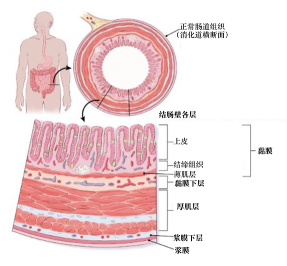
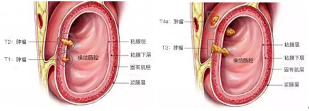
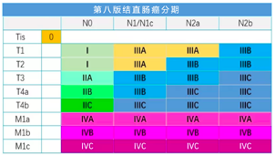

## TNM 分期

TNM 分期是从 T (Tumor,肿瘤), N (Node,淋巴结), M (Metastasis,转移) 三个维度来综合分析评估癌症的发展阶段。目前临床上所用的是第八版结直肠癌TNM分期:

T, Tumor, 原发肿瘤

| T分期 | 描述                                                         |
| ----: | :----------------------------------------------------------- |
|    Tx | 原发肿瘤                                                     |
|    T0 | 无原发肿瘤证据                                               |
|   Tis | 原位癌, 黏膜内癌(肿瘤侵犯黏膜固有层但未突破黏膜肌层)         |
|    T1 | 肿瘤侵犯黏膜下层                                             |
|    T2 | 肿瘤侵犯固有肌层                                             |
|    T3 | 肿瘤穿透固有肌层到达浆膜下层，或侵犯无腹膜覆盖的结直肠旁组织 |
|   T4a | 肿瘤穿透腹膜脏层                                             |
|   T4b | 肿瘤直接侵犯或粘连于邻近的器官或结构                         |

N, Node, 区域淋巴结

| N分期 | 描述                                                                      |
| ----- | ------------------------------------------------------------------------- |
| Nx    | 区域淋巴结无法评价                                                        |
| N0    | 无区域淋巴结转移                                                          |
| N1    | 有1~3枚区域淋巴结转移                                                     |
| N1a   | 有1枚区域淋巴结转移                                                       |
| N1b   | 有2~3枚区域淋巴结转移                                                     |
| N1c   | 浆膜下、肠系膜、无腹膜覆盖结肠/直肠周围组织内有肿瘤种植，无区域淋巴结转移 |
| N2    | 有4枚以上区域淋巴结转移                                                   |
| N2a   | 有4~6枚区域淋巴结转移                                                     |
| N2b   | 有≥7枚区域淋巴结转移                                                      |

我们的身体中存在很多淋巴结, 像哨兵一样监测病原体和恶变的细胞. 癌症发展到一定阶段,会派出部分癌细胞, 攻击附近的淋巴结. 

如果淋巴结未能消灭这些癌细胞, 就会被癌细胞占领, 成为原发肿瘤向远处转移的 “中转站”. 被 “攻占” 的淋巴结越多, N分期就越高.

M, Metastasis, 远处转移

| M分期 | 描述                                                                     |
| ----- | ------------------------------------------------------------------------ |
| Mx    | 远处转移无法评价                                                         |
| M0    | 无远处转移                                                               |
| M1    | 有远处转移                                                               |
| M1a   | 远处转移局限于单个器官（如肝、肺、卵巢、非区域淋巴结转移），但无腹膜转移 |
| M1b   | 远处转移分布于于两个及以上的远离部位或器官，无腹膜转移                   |
| M1c   | 腹膜转移（无论有无其他器官转移）                                         |

转移是恶性肿瘤的重要特点之一. 结直肠癌最常见的远处转移器官依次是肝, 肺, 骨和脑. 转移的器官越多, 对应的M分期越高.

根据TNM可综合判定结直肠癌的具体分期, 一般分为I期、II期、III期和IV期

cTNM: 根据影像学检查评估的临床 TNM 分期

pTNM: 根据术后病理评估的病理 TNM 分期

ypTNM: 接受新辅助治疗后的病理分期

